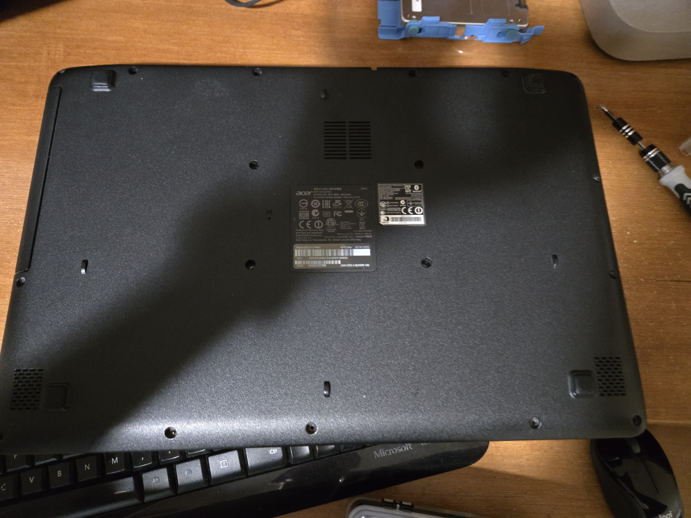
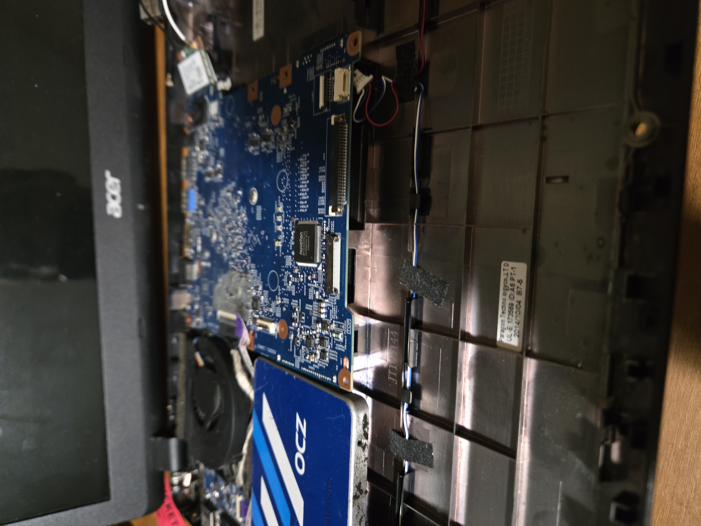
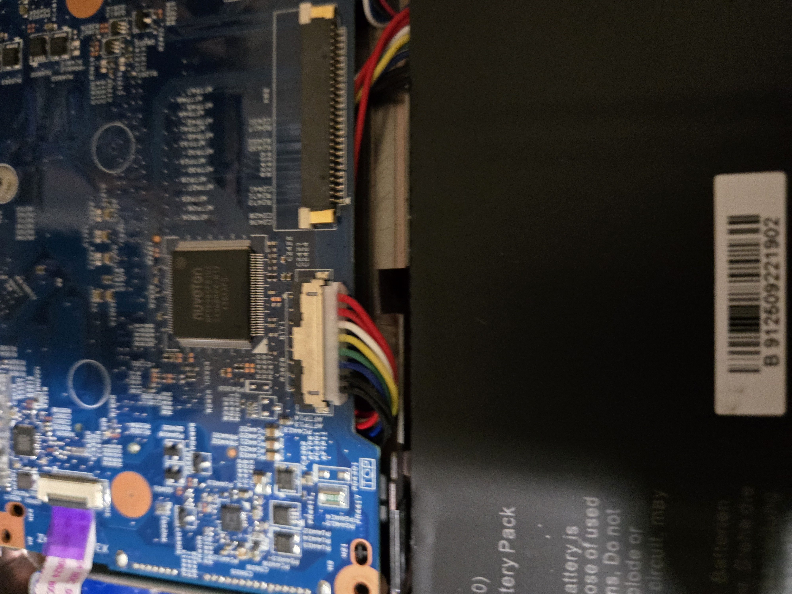
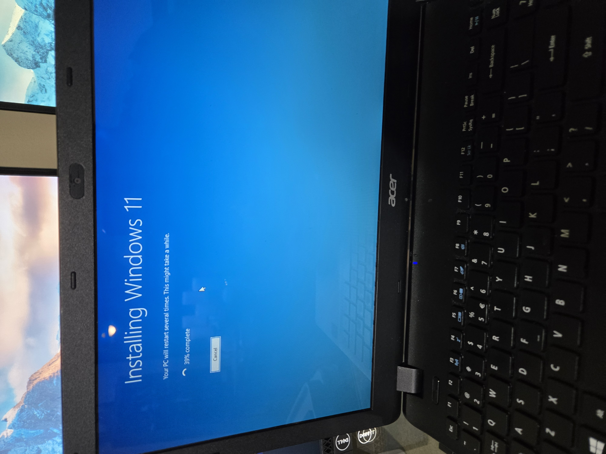

# acer-laptop-upgrade

# Acer Laptop Hardware Upgrade and Windows 11 Migration

## Project Overview
Upgraded an Acer laptop by replacing the battery, upgrading the RAM to 8GB, and migrating the system from Windows 10 to Windows 11 to improve performance and usability.

## Hardware Upgrades

### Battery Replacement
- Removed the original battery
- Installed a replacement battery
- Verified charging and battery functionality after installation

### RAM Upgrade
- Removed original RAM module
- Installed upgraded 8GB RAM module
- Verified RAM detection in BIOS and Windows

## Windows 11 Migration
- Verified system compatibility
- Upgraded laptop from Windows 10 to Windows 11
- Installed updates and drivers
- Verified system stability after installation

## Troubleshooting
- Carefully disassembled and reassembled the laptop
- Verified hardware connections after reassembly
- Tested system performance after upgrades
- Confirmed successful boot and operation

## Results
- Laptop successfully upgraded to Windows 11
- Improved system responsiveness
- Increased available memory to 8GB
- Improved battery performance and usability

## Skills Demonstrated
- Laptop hardware upgrades
- RAM installation
- Battery replacement
- Windows 10 to Windows 11 migration
- Hardware troubleshooting
- Operating system installation and upgrades
- Driver installation
- System verification and testing

## Project Photos

### Laptop Disassembly

### Internal Hardware Components

### Battery Replacement

### Windows 11 Installation

